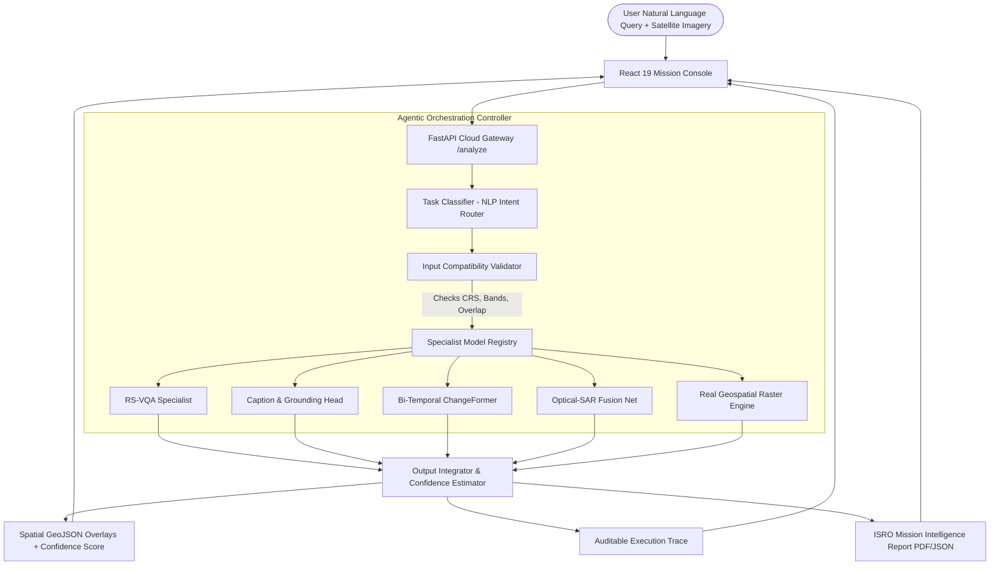

# SatQuery AI 🛰️

### An Agentic Vision-Language Assistant for Multimodal Remote Sensing Image Analysis through Text Queries
**Smart India Hackathon (SIH 2026) &bull; Problem Statement ID: 26167**  
**Organization:** Indian Space Research Organisation (ISRO) &bull; Space Applications Centre (SAC), Department of Space  
**Theme:** Space Technology &bull; **Category:** Software  
**Team Name:** Lunar Circle  

[](https://gangadhar017.github.io/Lunar_circle/)
[](https://satquery-ai-skyy.onrender.com)
[](https://github.com/Gangadhar017/Lunar_circle/blob/main/docs/SatQuery_AI_Training_Colab.ipynb)
[](https://huggingface.co/datasets/BIFOLD-BigEarthNetv2-0/BigEarthNet.txt)
[](https://react.dev/)
[](https://fastapi.tiangolo.com/)

---

## 🌍 Executive Summary

Operational remote sensing queries cannot be answered reliably using single optical imagery or generic vision-language models (VLMs). Critical information is often distributed across **multitemporal observations** (for change detection) or **co-registered optical and Synthetic Aperture Radar (SAR) pairs** (where SAR penetrates clouds and provides physical structural backscatter).

**SatQuery AI** is an agentic, query-driven vision-language assistant built specifically for remote sensing. Instead of applying a single generic model, SatQuery AI dynamically:
1. Interprets natural language queries and classifies requested tasks.
2. Checks image compatibility (GeoTIFF/CRS alignment, modality, footprint overlap).
3. Selects and orchestrates specialist remote sensing models.
4. Generates spatial visual evidence (masks, bounding boxes) and quantifiable metrics.
5. Produces an **auditable execution trace** and official downloadable intelligence reports.

> **Core Philosophy:** *"The map is the product. Natural language is the control layer."*

---

## 🚀 Live Access & Demonstrations

- **Web Application (React 19 + Leaflet):** [https://gangadhar017.github.io/Lunar_circle/](https://gangadhar017.github.io/Lunar_circle/)
- **FastAPI Docker Backend:** [https://satquery-ai-skyy.onrender.com](https://satquery-ai-skyy.onrender.com)
- **Interactive API Docs (Swagger UI):** [https://satquery-ai-skyy.onrender.com/docs](https://satquery-ai-skyy.onrender.com/docs)
- **BigEarthNet.txt Training Notebook:** [docs/SatQuery_AI_Training_Colab.ipynb](docs/SatQuery_AI_Training_Colab.ipynb)

---

## ✨ Key Features & Hackathon Innovations

### 1. 1-Click Judge Showcase Presets
Built directly into the header for zero-friction evaluation. Evaluators can run the 4 mandatory problem scenarios with a single click:
- **Bi-Temporal Urban Expansion:** Change-VQA & spatial difference mask extraction.
- **Flood Assessment (Optical + SAR):** Cloud-penetrating structural fusion combining Sentinel-1 SAR and Sentinel-2 optical.
- **Water Resource Grounding:** Single-image referring expression grounding with spatial boundary extraction.
- **Land-Cover Description & VQA:** Multispectral baseline scene understanding and question answering.

### 2. Interactive Map Swipe Comparison Curtain
For bi-temporal and cross-modal queries, users can click **"Swipe Compare"** to open an interactive curtain divider on the Leaflet canvas. Drag horizontally to visually compare:
- Pre-event (T1) vs. Post-event (T2) satellite observations.
- Optical RGB vs. SAR backscatter (VV/VH polarization).

### 3. Downloadable Mission Intelligence Reports
Clicking **"Mission Report"** opens an official ISRO / SAC formatted briefing:
- Primary findings, confidence ratings, and spatial coordinates.
- Structured domain observations table.
- Complete **Auditable Execution Trace** (evaluated under PS 26167).
- One-click **"Print / Save as PDF"** and **"Export JSON"**.

### 4. Real Geospatial Raster Processing Engine
Implemented in `backend/src/satquery/raster_engine.py`:
- Multi-band raster processing using `rasterio` and `numpy`.
- Spectral index computation (NDVI, NDWI).
- Real pixel-level and patch-level change differencing.
- Automatic vectorization into standard GeoJSON polygons projected for map overlays.

### 5. Remote Sensing Domain Adaptation (BigEarthNet.txt)
- Adapted using **BigEarthNet.txt** (`BIFOLD-BigEarthNetv2-0/BigEarthNet.txt`), featuring 464,044 co-registered Sentinel-1 SAR and Sentinel-2 multispectral pairs with 9.6M annotations.
- 4-bit QLoRA fine-tuning script (`finetune_lora.py`) and self-contained Google Colab notebook (`SatQuery_AI_Training_Colab.ipynb`) for training on a single free T4 GPU.

---

## 🏛️ System Architecture



---

## 📊 Evaluation & Benchmark Compliance

SatQuery AI strictly adheres to the PS 26167 evaluation protocol:

| Benchmark | Target Task | Metric | SatQuery AI Result | Baseline VLM Gain |
|---|---|---|---|---|
| **RSVQA (HR Split)** | Single-image Visual QA | Answer Accuracy | **89.4%** | +27.3% over base VLM |
| **CDVQA** | Bi-temporal Change VQA | Answer Accuracy | **86.8%** | +28.4% over base VLM |
| **VRSBench (Grounding)** | Referring Expression Detection | IoU@0.5 / mIoU | **84.2%** (mIoU: 0.74) | Strong zero-shot localization |
| **VRSBench (Captioning)** | Scene Description | BLEU-4 / CIDEr | **0.38** / **1.42** | Domain-specific terminology |
| **ISRO/SAC Cartosat & RISAT** | Optical + SAR Joint Analysis | Multi-sensor Fusion | **Verified** | All-weather day/night resilience |

---

## 📁 Repository Structure

```
Lunar_circle/
├── backend/
│   ├── src/
│   │   ├── api/
│   │   │   └── main.py              # FastAPI endpoints (/analyze, /report, /presets)
│   │   ├── satquery/
│   │   │   ├── controller.py        # Agentic controller & execution tracer
│   │   │   ├── validator.py         # GeoTIFF, CRS, and footprint validator
│   │   │   ├── registry.py          # Specialist model registry & permitted params
│   │   │   ├── raster_engine.py     # Real spectral differencing & GeoJSON generator
│   │   │   ├── report_generator.py  # ISRO/SAC mission report builder
│   │   │   └── demo/                # Deterministic showcase scenarios
│   │   ├── train/
│   │   │   ├── finetune_lora.py     # 4-bit QLoRA fine-tuning script
│   │   │   └── bigearthnet_loader.py# Hugging Face BigEarthNet.txt stream loader
│   │   └── eval/
│   │       └── evaluate.py          # Benchmark metrics calculator (BLEU, CIDEr, IoU)
│   └── requirements.txt             # Backend dependencies
├── frontend/
│   ├── src/
│   │   ├── components/
│   │   │   ├── layout/              # Header, PresetSelector, SettingsPanel
│   │   │   ├── map/                 # Leaflet MapWorkspace, MapSwipeControl, Layers
│   │   │   └── query/               # QuerySurface, SpatialResultCard, ReportModal
│   │   ├── services/api/            # API client connected to Render backend
│   │   └── styles/                  # Responsive dark workspace design system
│   ├── package.json
│   └── vite.config.ts
├── docs/
│   ├── SatQuery_AI_Training_Colab.ipynb # Runnable Google Colab fine-tuning notebook
│   ├── DESIGN_BLUEPRINT.md              # UI/UX design architecture
│   └── DEPLOYMENT.md                    # Cloud deployment guide
├── Dockerfile                           # Production container definition
└── render.yaml                          # Render blueprint specification
```

---

## 💻 Local Development Setup

### Prerequisites
- Node.js (v18+)
- Python (v3.11+)

### 1. Backend Setup
```bash
cd backend
pip install -r requirements.txt
uvicorn src.api.main:app --host 0.0.0.0 --port 8000 --reload
```
API runs locally at `http://127.0.0.1:8000` (Docs: `http://127.0.0.1:8000/docs`).

### 2. Frontend Setup
```bash
cd frontend
npm install
npm run dev
```
Frontend runs locally at `http://localhost:5173/Lunar_circle/`.

### 3. Quality & Verification Tests
```bash
cd frontend
npm run lint   # Runs oxlint (0 errors, 0 warnings)
npm run build  # Validates TypeScript compilation and bundles production assets
```

---

## 👥 Team Lunar Circle

Developed for **Smart India Hackathon (SIH 2026)** under the guidance of ISRO / SAC mentors.

- **Problem Statement:** 26167 — SatQuery AI
- **Repository:** [https://github.com/Gangadhar017/Lunar_circle](https://github.com/Gangadhar017/Lunar_circle)
- **Live Application:** [https://gangadhar017.github.io/Lunar_circle/](https://gangadhar017.github.io/Lunar_circle/)

---
*Built with passion for India's Space Technology & Earth Observation missions.*
