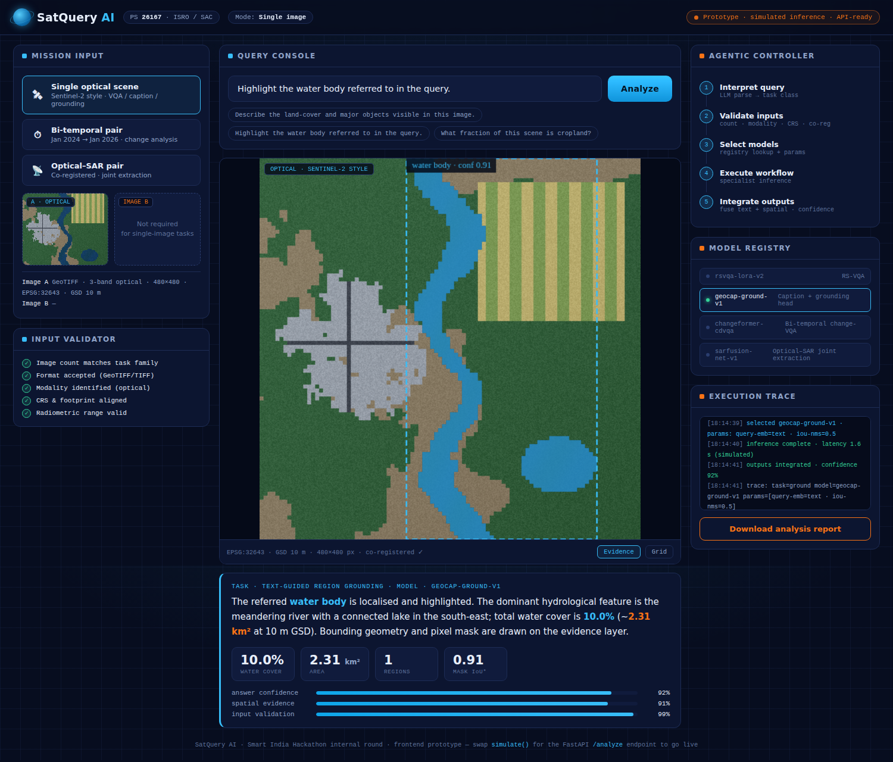
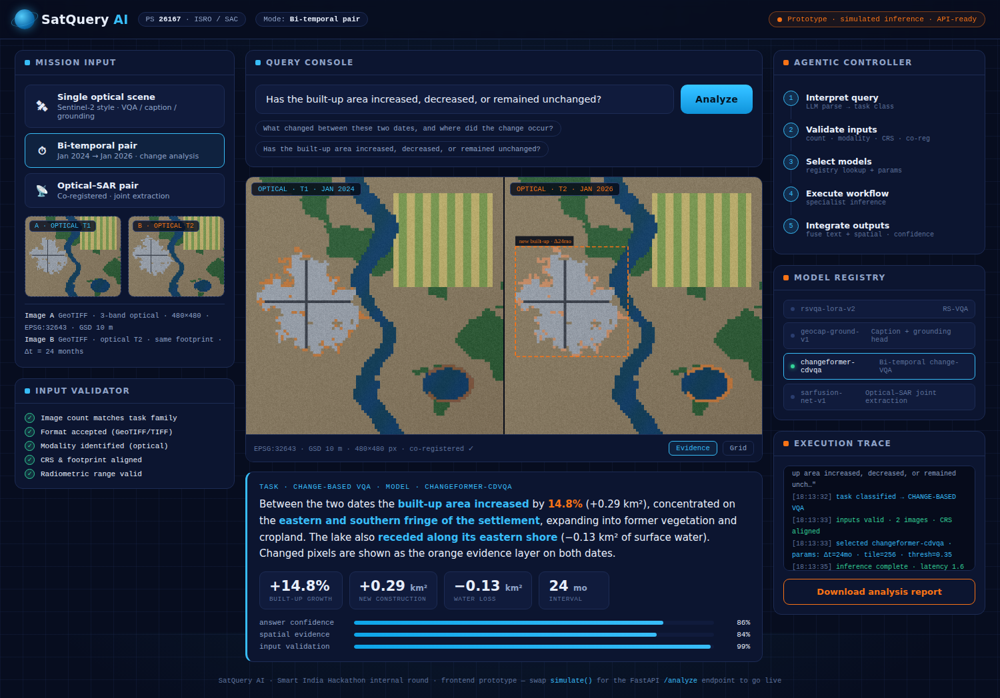
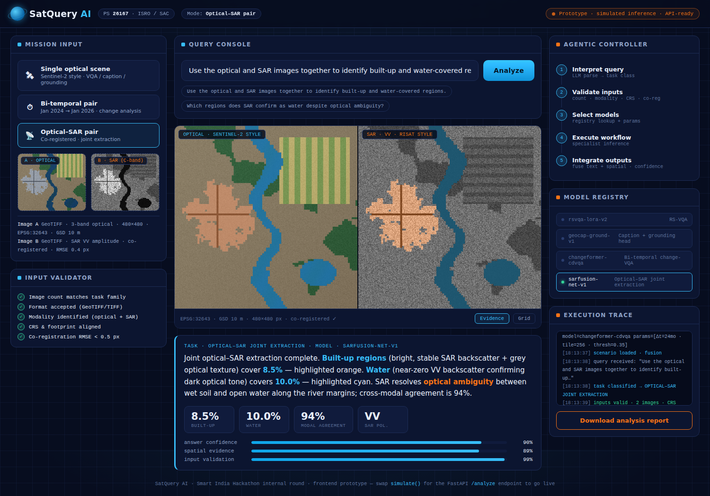
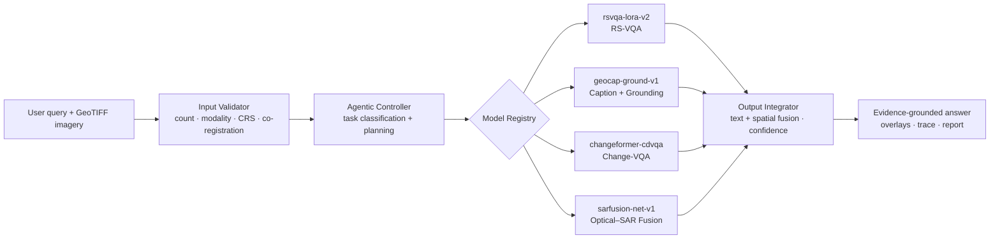

# SatQuery AI 🛰

**An Interactive Vision-Language Assistant for Multimodal Remote Sensing Image Analysis through Text Queries**

> Smart India Hackathon — Internal Round · Problem Statement **26167** · Indian Space Research Organisation (ISRO / SAC) · Theme: Space Technology · Category: Software

Ask satellites questions in plain language. SatQuery AI is an **agentic** vision-language system: instead of one generic VLM guessing at everything, a controller interprets each query, validates the input imagery, routes the task to fine-tuned remote-sensing specialist models, and returns an **evidence-grounded** answer — with masks, boxes, confidence scores and an auditable execution trace.

---

## 🚀 Live demo (this repo)

Open **[`demo/SatQuery_AI_Demo.html`](demo/SatQuery_AI_Demo.html)** in any browser — single file, no install, works offline.

The prototype demonstrates the complete product flow on procedurally generated optical / SAR / bi-temporal scenes. Model inference is **simulated** (swap the `simulate()` path for the FastAPI `/analyze` endpoint to go live); all overlay geometry and statistics are computed for real from the scene class map, so every answer is internally consistent.

| Text-guided grounding | Bi-temporal change VQA | Optical–SAR fusion |
|---|---|---|
|  |  |  |

**What the demo covers (mapped to the PS mandatory scope):**

- ✅ Single-image **VQA** + **captioning** + **text-guided grounding** (mandatory baseline + extra task)
- ✅ **Bi-temporal change analysis** — change description, change-VQA, spatial change map
- ✅ **Optical–SAR joint extraction** on a co-registered pair
- ✅ **Agentic orchestration** — task classification → input validation → model selection → execution → output integration
- ✅ **Input compatibility checking** — asks for a change analysis on a single image? The validator rejects execution and tells you what's missing
- ✅ **Auditable execution trace**, confidence estimates, and a **downloadable analysis report**

## 🧠 Architecture



**Planned stack:** PyTorch · HF Transformers · Qwen2.5-VL / GeoChat base · LoRA/PEFT · LangGraph · GDAL/rasterio · FastAPI · React · Docker

## 📚 Datasets (as prescribed)

- **BigEarthNet.txt** ([arXiv:2603.29630](https://arxiv.org/abs/2603.29630) · [txt.bigearth.net](https://txt.bigearth.net)) — primary fine-tuning: **464,044 co-registered Sentinel-1 SAR + Sentinel-2 multispectral** images with **9.6M annotations** — geographically anchored captions, VQA pairs, and referring-expression detection instructions, plus a manually verified benchmark split
- **VRSBench** — evaluation: single-image captioning, grounding & VQA
- **RSVQA** — evaluation: remote-sensing visual question answering
- **CDVQA** — evaluation: multitemporal change-based VQA

Full dataset cards, layout and download helper: [`data/README.md`](data/README.md) · `python scripts/download_datasets.py`

Final evaluation additionally targets the ISRO/SAC hidden set of pre-georeferenced **Cartosat-2S optical + RISAT SAR** pairs.

## 📁 Repository

```
├── demo/SatQuery_AI_Demo.html        # interactive prototype (open in browser)
├── docs/SatQuery_AI_SIH_26167.pptx   # idea-round presentation deck
├── data/README.md                    # dataset cards (BigEarthNet.txt, VRSBench, RSVQA, CDVQA)
├── scripts/download_datasets.py      # dataset layout / download helper
└── src/
    ├── satquery/
    │   ├── controller.py             # agentic controller: classify → validate → route → trace
    │   ├── validator.py              # input compatibility checks (format, modality, CRS, co-reg)
    │   ├── registry.py               # specialist model registry + permitted parameters
    │   └── models/                   # rsvqa-lora · geocap-ground · changeformer-cdvqa · sarfusion-net
    ├── train/finetune_lora.py        # LoRA adaptation on BigEarthNet.txt (4-bit, single-GPU)
    ├── eval/evaluate.py              # accuracy · BLEU/CIDEr · IoU on prescribed test splits
    └── api/main.py                   # FastAPI /analyze — the contract the demo frontend targets
```

### Quickstart

```bash
pip install -r requirements.txt
python scripts/download_datasets.py                 # prepare data/ layout
python src/train/finetune_lora.py --task vqa \
    --data data/bigearthnet_txt --out checkpoints/rsvqa-lora-v2
uvicorn src.api.main:app --reload                   # serve the agentic backend
```

The controller, validator, task router and API contract run today (`NotTrainedYet` is surfaced
cleanly until adapters from `finetune_lora.py` are attached to each specialist's `weights_path`).

## 🗺 Roadmap to finals

1. LoRA fine-tune the VLM backbone on BigEarthNet (Sentinel-1 + Sentinel-2)
2. Stand up the FastAPI `/analyze` backend implementing the registry contract used by the demo frontend
3. Benchmark on prescribed VRSBench / RSVQA / CDVQA test splits (accuracy · BLEU/CIDEr · IoU, normalised)
4. Harden GDAL preprocessing for Cartosat-2S / RISAT domain transfer

## 👥 Team

Team **Lunar Circle** — SIH internal round submission.

*Prototype note: the demo runs simulated inference on synthetic scenes by design — the agentic pipeline, validator, routing and evidence system are real and API-ready.*
