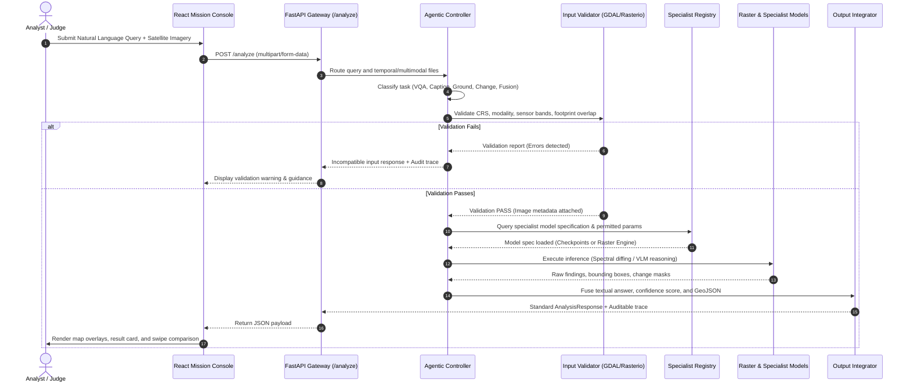

# SatQuery AI &mdash; System Sequence Diagram

This document details the end-to-end request-response sequence across the user interface, agentic controller, input validator, specialist registry, and output integrator.

